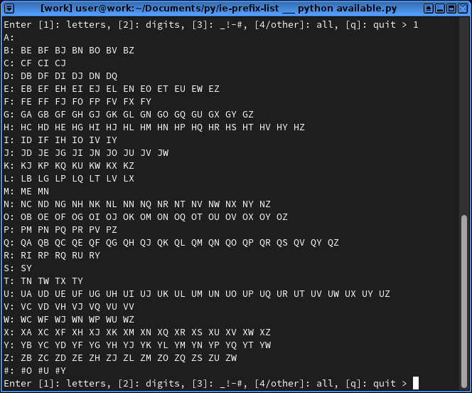

# IE community prefix list availability 
The script displays the available two-character prefix combinations that are still available and conform to the recommended format.

## Installation
Python is needed to run the script.

## How to use
* Replace the content of table.txt with the content of the two tables from http://www.blackwyrmlair.net/prefixes/ (need to wait for ad)
    * Delete the content of table.txt with a simple text editor (Notepad, etc)
    * Go to http://www.blackwyrmlair.net/prefixes/ You will be redirected and will need to click past an ad
    * Click before the first entry (0x), hold shift, click in the last cell of the first table, copy by pressing Ctrl+C
    * Paste in table.txt
    * Copy the content of the second table, and paste them in the file as well
* Run the script available.py. It displays all results. Enter q to quit, number 1-3 to get specific results, or any other letter/number for full list
The output shows all available two-character prefixes of [A-Za-z][0-9A-Za-z#_!-] or [#][A-Za-z_!-] as described in the first post here http://forums.blackwyrmlair.net/index.php?showtopic=113

## Example output (shows past content)
**Note:** This list is most likely out of date (2021-Jan), update table.txt and run the script for up-to-date information.

When pressing '1':

## License
MIT
